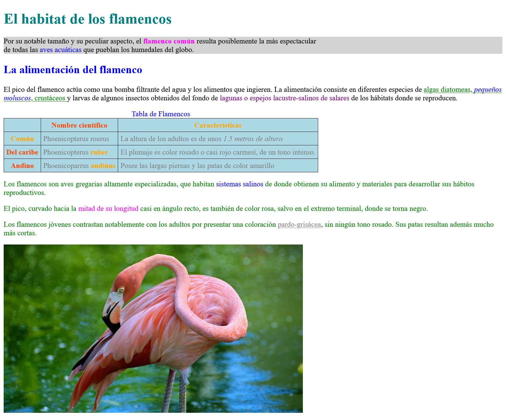

# Práctica 4.3 Selectores y estilos CSS

A partir del documento HTML del repositorio *(ejercicio4.3.html)*, añade las reglas **CSS** necesarias (sin editar el HTML) para que dicha página tenga la siguiente apariencia final:

